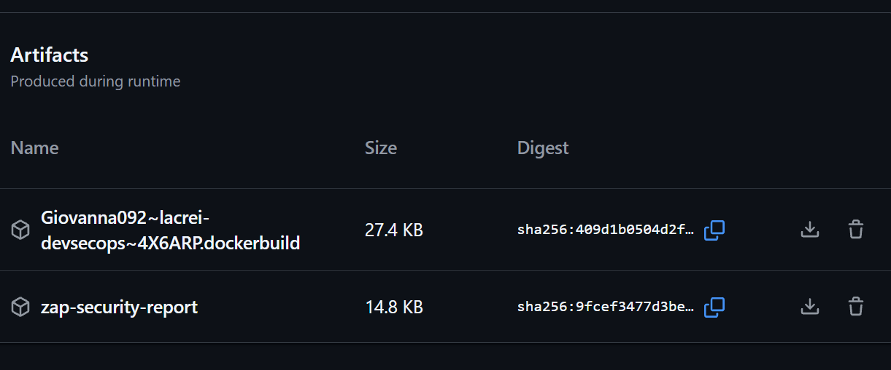
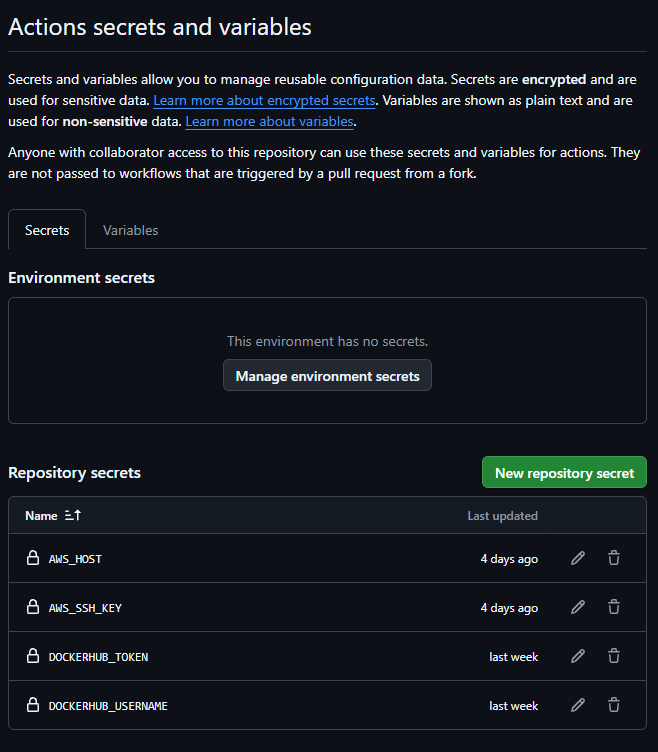

# Lacrei DevSecOps

Pipeline de CI/CD para uma aplicação Node.js, com testes automatizados, build Docker, análise de segurança com OWASP ZAP, publicação no Docker Hub e deploy automatizado em uma instância AWS Lightsail.

## Ambiente publicado

A aplicação está publicada em uma instância AWS Lightsail e pode ser acessada pelo endereço:

**http://54.233.16.222:3000/status**

### Validação

Para verificar o funcionamento da aplicação, acesse a rota `/status` pelo navegador ou execute:

```bash
curl http://54.233.16.222:3000/status
```
A resposta esperada é:

``` bash
{"status":"ok"}
```

A rota /status é utilizada para verificar se a aplicação está em execução e acessível.

## Fluxo

```text
Push na main
    |
    v
  CI
  ├── npm install
  ├── Jest
  ├── Docker build
  └── OWASP ZAP
    |
    | sucesso
    v
  CD
  ├── Build da imagem
  ├── Push para Docker Hub
  └── Deploy via SSH na AWS Lightsail
          |
          v
      Docker container
          |
          v
  /status -> {"status":"ok"}
```

## Tecnologias

- Node.js / npm
- Jest
- Docker
- GitHub Actions
- OWASP ZAP
- Docker Hub
- AWS Lightsail
- Ubuntu
- SSH

## Aplicação

A aplicação possui o endpoint de verificação:

```text
GET /status
```

Resposta esperada:

```json
{"status":"ok"}
```

## CI/CD

O workflow `CI` executa os testes, constrói a imagem Docker e executa uma análise dinâmica com OWASP ZAP.

O workflow `CD` é disparado após uma execução bem-sucedida do `CI` na branch `main`. Ele publica a imagem no Docker Hub e, em seguida, conecta-se à instância AWS por SSH para atualizar o container da aplicação.

## Proteção da branch principal

A branch `main` é protegida por um GitHub Ruleset.

Para que alterações sejam incorporadas à `main`:

- é necessário utilizar um Pull Request;
- o check `build-and-test` do GitHub Actions deve ser concluído com sucesso;
- a branch deve estar atualizada antes do merge;
- force pushes são bloqueados;
- a exclusão da branch é restrita.

O workflow de CD é executado somente após uma execução bem-sucedida do CI associada à branch `main`.

Fluxo de publicação:

feature/* → Pull Request → CI → main → CD → Docker Hub → AWS Lightsail

## Rollback

As imagens Docker publicadas no Docker Hub recebem uma tag correspondente ao commit que gerou a versão.

O deploy utiliza a imagem identificada pelo SHA do commit validado pelo CI, enquanto a tag `latest` também é mantida no Docker Hub.

Em caso de falha após um deploy, é possível reverter manualmente para uma versão anterior utilizando a tag SHA correspondente.

### Procedimento

1. Identificar no Docker Hub a tag SHA da versão anterior que deve ser restaurada.
2. Acessar a instância AWS via SSH.
3. Executar:

```bash
sudo docker pull giovanna092/lacrei-devsecops:<SHA_DA_VERSAO_ANTERIOR>

sudo docker stop lacrei-app || true
sudo docker rm lacrei-app || true

sudo docker run -d \
  --name lacrei-app \
  --restart unless-stopped \
  -p 3000:3000 \
  giovanna092/lacrei-devsecops:<SHA_DA_VERSAO_ANTERIOR>

### Relatório de segurança

A análise dinâmica da aplicação é realizada pelo OWASP ZAP durante o pipeline de CI.

Ao final da execução, o relatório HTML gerado pelo ZAP é disponibilizado como artefato do GitHub Actions com o nome:

`zap-security-report`

Para acessá-lo, entre em **GitHub → Actions → execução do workflow CI → Artifacts → zap-security-report**.



### Critério de segurança

O OWASP ZAP é executado durante o CI para realizar análise dinâmica da aplicação.

O pipeline utiliza o seguinte critério:

- Regras configuradas como `FAIL` bloqueiam o pipeline quando identificadas pelo ZAP.
- Alertas classificados como `WARN` são registrados no relatório, mas não bloqueiam a execução.
- Resultados `PASS` são considerados verificações sem alerta.

Atualmente, a regra `10055` — `CSP: Failure to Define Directive with No Fallback` — está configurada como `FAIL` no arquivo `zap-rules.conf`. Os demais alertas identificados permanecem como `WARN`.

Como evidência do funcionamento do critério, foi realizada uma execução controlada em que a regra `10055` foi identificada pelo ZAP como `FAIL`, resultando no bloqueio do pipeline:

```text
FAIL-NEW: CSP: Failure to Define Directive with No Fallback [10055] x 1
FAIL-NEW: 1
Error: Process completed with exit code 1
```

## Gerenciamento de credenciais

As credenciais utilizadas no processo de CI/CD não são armazenadas diretamente no código-fonte.

O workflow de CD utiliza GitHub Secrets para armazenar informações sensíveis utilizadas na autenticação com o Docker Hub e no acesso SSH à instância AWS.

Secrets utilizados:

- `DOCKERHUB_USERNAME` — usuário do Docker Hub.
- `DOCKERHUB_TOKEN` — token de autenticação do Docker Hub.
- `AWS_HOST` — endereço da instância AWS utilizada no deploy.
- `AWS_SSH_KEY` — chave privada utilizada para autenticação SSH.

Os secrets são referenciados no workflow por meio do contexto `secrets` do GitHub Actions e seus valores não são documentados ou armazenados no repositório.

Como evidência, os nomes dos secrets podem ser consultados em:

**GitHub → Settings → Secrets and variables → Actions**


As referências aos secrets podem ser verificadas no arquivo:

`.github/workflows/cd.yml`

## Análise de segurança

O pipeline possui duas camadas de análise de segurança:

- **Dependency Review:** executado em Pull Requests para identificar vulnerabilidades nas dependências adicionadas ou alteradas. Vulnerabilidades classificadas como `HIGH` ou superiores bloqueiam o workflow.
- **OWASP ZAP:** executado contra a aplicação em execução para realizar análise dinâmica de segurança.

O OWASP ZAP possui regras configuradas no arquivo `zap-rules.conf`. Regras configuradas como `FAIL` bloqueiam o pipeline quando identificadas.

## Documentação

A documentação técnica detalhada da implementação está em:

[`docs/technical_documentation.md`](docs/technical_documentation.md)
